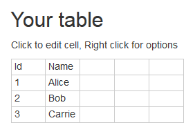

# Plain Text Table - User Manual

Interactively create and edit tables and export them to plain text.
The tool can be used [online](https://jmini.github.io/plain-text-table/).

## Edit the table

The table can be edited in two ways, with the `Grid` and the `Text` tabs.

### Grid tab

Edit the grid and fill it with the the data you want to represent as text.

With the context menu in each cell, the text alignment (vertical and horizontal) can be set.
Those properties are reflected in the output.

Merged cells are supported (colspan and rowspan).
Select the cells you want to merge, use the context menu and select `Merge cells`.
Merged cells can be unmerged the same way (with the menu item `Unmerge cells`)

If you just want to try the tool out, the links above the grid fill it with example data and select a matching style.
Those links are ordinary shared links (see below), the browser can go back and forth between them:

* __contact list__: a simple table with an Ascii output.
* __weekly schedule__: merged and multiline cells with a Unicode output.
* __spreadsheet__: letters as column headers and numbers as line headers, like in Excel.

### Text tab

Paste a table that was produced by this tool and press `Convert back to the grid` to get its content back into the grid.
This is useful when you copy a table back from a document, an email or a prompt and want to change it.

The button `Fill with the table below` puts the current output in the text area, as a starting point.

The content of the cells, the merged cells and the cells holding several lines are recognized.
The style is recognized too: the charset, the borders, the headers, the Ascii intersection character
and the padding are read back from the drawing and selected in the configuration.

Some things cannot be read back, because the drawing does not tell them apart from something else:

* When the table is drawn without a border between the lines, a cell holding several lines of text cannot be distinguished from several lines.
* When the table is drawn without a border between the columns, the columns cannot be located at all and nothing is read.
* The text alignment of the cells is not recognized.

When a style cannot be told apart from another one, both produce the same table anyway.

## Charset option

* Unicode
* Ascii

## Headers option

### Horizontal Header:

Type of column headers.

* __None__: No header. The first line is directly the content.
* __First line__: The first line of the table is used as header.
* __Number__: number are used as column header.
* __Letter__: letters are used as column header (A, B, C.. - like in Excel).

### Vertical Header:

Type of line headers.

* __None__: No header. The first column is directly the content.
* __First column__: The first column of the table is used as header.
* __Number__: number are used as line header (1, 2, 3.. - like in Excel).
* __Letter__: letters are used as line header.

## Borders option

For each border you can select:

* __None__: no border at all
* __Single__: single border
* __Double__: double border

Depending on the char set (Unicode or ASCII) some combinations are not possible.

To help you to understand which border your are modifying with one combo box, the border corresponding to the selected combo box is highlighted in the output.
To remove the highlighting just focus somewhere else. 

### Horizontal Top Border

    XXXXXXXXXXXXXXXXXXXXXXXXXXXXXXXXXXXXXXXXXXXXXXXXXXX
    ║   ║   Name    │ First Name │ Track Id │ Checked ║
    ╠═══╬═══════════╪════════════╪══════════╪═════════╣
    ║ 1 ║ Sheffield │ Alice      │      347 │   yes   ║
    ╟───╫───────────┼────────────┼──────────┼─────────╢
    ║   ║           │ Carrie,    │          │         ║
    ║ 2 ║ Smith     │ Bob and    │      152 │         ║
    ║   ║           │ Friends    │          │         ║
    ╟───╫───────────┼────────────┼──────────┼─────────╢
    ║ 3 ║ Samson    │ Dick       │      948 │   yes   ║
    ╚═══╩═══════════╧════════════╧══════════╧═════════╝

### Horizontal Inner Header Border

    ╔═══╦═══════════╤════════════╤══════════╤═════════╗
    ║   ║   Name    │ First Name │ Track Id │ Checked ║
    XXXXXXXXXXXXXXXXXXXXXXXXXXXXXXXXXXXXXXXXXXXXXXXXXXX
    ║ 1 ║ Sheffield │ Alice      │      347 │   yes   ║
    ╟───╫───────────┼────────────┼──────────┼─────────╢
    ║   ║           │ Carrie,    │          │         ║
    ║ 2 ║ Smith     │ Bob and    │      152 │         ║
    ║   ║           │ Friends    │          │         ║
    ╟───╫───────────┼────────────┼──────────┼─────────╢
    ║ 3 ║ Samson    │ Dick       │      948 │   yes   ║
    ╚═══╩═══════════╧════════════╧══════════╧═════════╝

This border is only present if column headers are defined (`horizontal header` set to `first line`, `number` or `letter`).

### Horizontal Inner Border

    ╔═══╦═══════════╤════════════╤══════════╤═════════╗
    ║   ║   Name    │ First Name │ Track Id │ Checked ║
    ╠═══╬═══════════╪════════════╪══════════╪═════════╣
    ║ 1 ║ Sheffield │ Alice      │      347 │   yes   ║
    XXXXXXXXXXXXXXXXXXXXXXXXXXXXXXXXXXXXXXXXXXXXXXXXXXX
    ║   ║           │ Carrie,    │          │         ║
    ║ 2 ║ Smith     │ Bob and    │      152 │         ║
    ║   ║           │ Friends    │          │         ║
    XXXXXXXXXXXXXXXXXXXXXXXXXXXXXXXXXXXXXXXXXXXXXXXXXXX
    ║ 3 ║ Samson    │ Dick       │      948 │   yes   ║
    ╚═══╩═══════════╧════════════╧══════════╧═════════╝

### Horizontal Bottom Border

    ╔═══╦═══════════╤════════════╤══════════╤═════════╗
    ║   ║   Name    │ First Name │ Track Id │ Checked ║
    ╠═══╬═══════════╪════════════╪══════════╪═════════╣
    ║ 1 ║ Sheffield │ Alice      │      347 │   yes   ║
    ╟───╫───────────┼────────────┼──────────┼─────────╢
    ║   ║           │ Carrie,    │          │         ║
    ║ 2 ║ Smith     │ Bob and    │      152 │         ║
    ║   ║           │ Friends    │          │         ║
    ╟───╫───────────┼────────────┼──────────┼─────────╢
    ║ 3 ║ Samson    │ Dick       │      948 │   yes   ║
    XXXXXXXXXXXXXXXXXXXXXXXXXXXXXXXXXXXXXXXXXXXXXXXXXXX

### Vertical Left Border

    X═══╦═══════════╤════════════╤══════════╤═════════╗
    X   ║   Name    │ First Name │ Track Id │ Checked ║
    X═══╬═══════════╪════════════╪══════════╪═════════╣
    X 1 ║ Sheffield │ Alice      │      347 │   yes   ║
    X───╫───────────┼────────────┼──────────┼─────────╢
    X   ║           │ Carrie,    │          │         ║
    X 2 ║ Smith     │ Bob and    │      152 │         ║
    X   ║           │ Friends    │          │         ║
    X───╫───────────┼────────────┼──────────┼─────────╢
    X 3 ║ Samson    │ Dick       │      948 │   yes   ║
    X═══╩═══════════╧════════════╧══════════╧═════════╝

### Vertical Inner Header Border

    ╔═══X═══════════╤════════════╤══════════╤═════════╗
    ║   X   Name    │ First Name │ Track Id │ Checked ║
    ╠═══X═══════════╪════════════╪══════════╪═════════╣
    ║ 1 X Sheffield │ Alice      │      347 │   yes   ║
    ╟───X───────────┼────────────┼──────────┼─────────╢
    ║   X           │ Carrie,    │          │         ║
    ║ 2 X Smith     │ Bob and    │      152 │         ║
    ║   X           │ Friends    │          │         ║
    ╟───X───────────┼────────────┼──────────┼─────────╢
    ║ 3 X Samson    │ Dick       │      948 │   yes   ║
    ╚═══X═══════════╧════════════╧══════════╧═════════╝

This border is only present if line headers are defined (`vertical header` set to `first column`, `number` or `letter`).

### Vertical Inner Border

    ╔═══╦═══════════X════════════X══════════X═════════╗
    ║   ║   Name    X First Name X Track Id X Checked ║
    ╠═══╬═══════════X════════════X══════════X═════════╣
    ║ 1 ║ Sheffield X Alice      X      347 X   yes   ║
    ╟───╫───────────X────────────X──────────X─────────╢
    ║   ║           X Carrie,    X          X         ║
    ║ 2 ║ Smith     X Bob and    X      152 X         ║
    ║   ║           X Friends    X          X         ║
    ╟───╫───────────X────────────X──────────X─────────╢
    ║ 3 ║ Samson    X Dick       X      948 X   yes   ║
    ╚═══╩═══════════X════════════X══════════X═════════╝

### Vertical Bottom Border

    ╔═══╦═══════════╤════════════╤══════════╤═════════X
    ║   ║   Name    │ First Name │ Track Id │ Checked X
    ╠═══╬═══════════╪════════════╪══════════╪═════════X
    ║ 1 ║ Sheffield │ Alice      │      347 │   yes   X
    ╟───╫───────────┼────────────┼──────────┼─────────X
    ║   ║           │ Carrie,    │          │         X
    ║ 2 ║ Smith     │ Bob and    │      152 │         X
    ║   ║           │ Friends    │          │         X
    ╟───╫───────────┼────────────┼──────────┼─────────X
    ║ 3 ║ Samson    │ Dick       │      948 │   yes   X
    ╚═══╩═══════════╧════════════╧══════════╧═════════X

## ASCII intersection character

When the charset is set to `Ascii`, this option allows to configure what the character at the intersection of two borders will be.

__Plus__ (default):

    +====+========+
    | Id | Name   |
    +====+========+
    | 1  | Alice  |
    +----+--------+
    | 2  | Bob    |
    +----+--------+
    | 3  | Carrie |
    +====+========+

__Horizontal border__:

    ===============
    | Id | Name   |
    ===============
    | 1  | Alice  |
    ---------------
    | 2  | Bob    |
    ---------------
    | 3  | Carrie |
    ===============

__Vertical border__:

    |====|========|
    | Id | Name   |
    |====|========|
    | 1  | Alice  |
    |----|--------|
    | 2  | Bob    |
    |----|--------|
    | 3  | Carrie |
    |====|========|

## Cell padding

There is a checkbox to configure if additional spaces should be added to ensure a cell padding of one space in each cell.

__Checked__ (default):

    ┌────┬────────┐
    │ Id │ Name   │
    ├────┼────────┤
    │ 1  │ Alice  │
    │ 2  │ Bob    │
    │ 3  │ Carrie │
    └────┴────────┘

__Not checked__:

    ┌──┬──────┐
    │Id│Name  │
    ├──┼──────┤
    │1 │Alice │
    ├──┼──────┤
    │2 │Bob   │
    ├──┼──────┤
    │3 │Carrie│
    └──┴──────┘

## Predefined style

In order to help you with the configuration of the tool, you can select one of the predefined styles.
Just click on the image corresponding to the style you want to apply.

The style marked `Markdown` produces the table syntax of Markdown, which can be pasted as is in a
`README.md`, in a GitHub issue or in a prompt:

    | Name      | First Name | Track Id | Checked |
    |-----------|------------|----------|---------|
    | Sheffield | Alice      | 347      | yes     |
    | Smith     | Bob        | 152      |         |
    | Samson    | Dick       | 948      | yes     |

## Output

The output is displayed right below the table.
The `Copy to clipboard` button below the output copies it as plain text, ready to be pasted anywhere.

## Your table is kept

The table you are working on is saved in your browser and is still there when you come back or
reload the page. Like everything else in this tool, it never leaves your browser.

The `Clear the table` button of the `Grid` tab empties the table, keeping the style you selected.

## Share a link

The `Copy link to this table` button puts a link to the current table in the clipboard (and in the address bar of the browser).

Everything you can set in the tool travels in the link: the content of the grid, the merged cells, the text alignment of each cell and all the configuration options.
It is compressed and stored in the part of the link that follows the `#`, so nothing is ever sent to a server.
Opening such a link restores the table exactly as it was.

As long as the address bar holds such a link, it follows what you do: each change you make to the table or to the configuration updates it, so the link is always the one you would want to share.
A page opened without a shared table keeps a clean address bar until you ask for a link with the button.